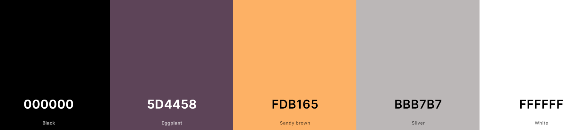

# Memory Card Game 
## Rock Star Version
This Memory Card game follows the classic version's structure and goals. However, this updated version includes a deck of 20 cards containing 10 pairs, featuring 10 famous and popular rock stars. The game is simple and intuitive, requiring players to click on each card to flip it over and find its matching pair.

Before starting the game, players will be prompted to log in and enter their name. The name should contain at least 3 and no more than 12 characters. Once the name is entered, players can click the start button and begin playing.

Upon starting the game, players will be presented with a deck of cards. Clicking each card one by one will reveal its face, and players must find all 10 pairs to complete the game. The objective of the game is to complete it with as few attempts as possible.

We hope you enjoy playing the Rok Star memory game!

# Live Demo
You can find a live demo [here](https://zanettiprado.github.io/rock-memory-game/index.html)

# User Experience (UX)

## Ideal visitor for this page - Game page

- Children who enjoy playing memory games and want to improve their memory skills in a fun way. The game is easy to understand and visually appealing, making it an enjoyable experience for kids.

- Adults who want a quick and entertaining distraction during their work break or leisure time. The game can be played in short intervals, making it a perfect activity to fill short gaps of free time.

- Gamers who enjoy competition and challenge. The game allows users to compete with friends and family to see who can complete the game with the fewest attempts possible, creating a dynamic and fun experience.

- Elderly individuals who want to exercise their memory and cognitive skills in a simple and easy way. The game is not only entertaining but also has potential cognitive benefits, making it an ideal activity for seniors.

- Individuals who are learning a new language or want to improve their vocabulary. The game can be customized with different word sets, making it a useful tool for language learners to practice vocabulary.

## User Stories

### First-time player:

1. As a first-time player, I want to be able to easily understand the rules and gameplay of the memory game so that I can start playing quickly.
2. I want to be able to create a new account easily, using a simple registration process and a username of my choice.
3. I want to have fun while playing the game and enjoy the experience.

### Returning player:

1. As a returning player, I want to be able to start a new game quickly, without having to go through a lengthy login process.
2. I want to be able to play the game as a way to take a break from work or other activities.
3. I want to be able to challenge myself to improve my performance by reducing the number of attempts required to complete the game.

### Frequent player:

1. As a frequent player, I want to be able to see if any new features have been added to the game, such as new characters or more cards.
2. I want to be able to play the game as a way to continue training my memory and cognitive skills.
3. I want to be able to choose from different difficulty levels, including a harder mode, to make the game more challenging.

# Language used 
- HTML
- CSS
- JavaScript

## Design

### Colour Scheme
Color scheme was created using the following colours. 
- `#FDB165`
- `#5D4458`
- `#000000`
- `#FFFFFF`
- `#BBB7B7`

These colors were used to create a calm enviroment and contrast with the very colorful background and images. As you can see images are cartoons or paitings from Rock Stars. Colourful background and images were chosen to make the player feel happy and wantig play more times. 

 

### -Typography

### -Imagery

## - Wireframes

# Features

-Responsive on all device sizes

-Interactive elements

# Testing

## Further Testing
- The Website was tested on Google Chrome, Internet Explorer, Microsoft Edge and Safari browsers.
- The website was viewed on a variety of devices such as Desktop, Laptop, iPhone7, iPhone 8 & iPhoneX.
- A large amount of testing was done to ensure that all pages were linking correctly.
- Friends and family members were asked to review the site and documentation to point out any bugs and/or user experience issues.

## Known Bugs

# Deployment

## GitHub Pages

## Forking the GitHub Repository
Forking a GitHub repository allows us to make a copy of the original repository on our own GitHub account, enabling us to view and make changes without affecting the original repository. To fork a GitHub repository, follow these steps:

- Log in to GitHub and navigate to the desired repository.
- Click the "Fork" button located at the top of the repository, just above the "Settings" button. This will create a copy of the original repository in your GitHub account.

## Making a Local Clone
Cloning a GitHub repository allows us to download a copy of the repository onto our local machine, making it easier to make changes and contribute to the project. To clone a GitHub repository, follow these steps:

- Log in to GitHub and navigate to the desired repository.
- Under the repository name, click "Clone or download".
- Copy the HTTPS link provided.
- Open Git Bash.
- Change the current working directory to the location where you want the cloned directory to be saved.
- Type git clone and paste the copied HTTPS link to initiate the cloning process.

# Credits

## media 

