# Memory Card Game 
## Rock Star Version
This Memory Card game follows the classic version's structure and goals. However, this updated version includes a deck of 20 cards containing 10 pairs, featuring 10 famous and popular rock stars. The game is simple and intuitive, requiring players to click on each card to flip it over and find its matching pair.

Before starting the game, players will be prompted to log in and enter their name. The name should contain at least 3 and no more than 12 characters. Once the name is entered, players can click the start button and begin playing.

Upon starting the game, players will be presented with a deck of cards. Clicking each card one by one will reveal its face, and players must find all 10 pairs to complete the game. The objective of the game is to complete it with as few attempts as possible.

We hope you enjoy playing the Rok Star memory game!

# Live Demo
You can find a live demo [here](https://zanettiprado.github.io/rock-memory-game/index.html)

# User Experience (UX)

## Ideal visitor for this page - Game page

- Children who enjoy playing memory games and want to improve their memory skills in a fun way. The game is easy to understand and visually appealing, making it an enjoyable experience for kids.

- Adults who want a quick and entertaining distraction during their work break or leisure time. The game can be played in short intervals, making it a perfect activity to fill short gaps of free time.

- Gamers who enjoy competition and challenge. The game allows users to compete with friends and family to see who can complete the game with the fewest attempts possible, creating a dynamic and fun experience.

- Elderly individuals who want to exercise their memory and cognitive skills in a simple and easy way. The game is not only entertaining but also has potential cognitive benefits, making it an ideal activity for seniors.

- Individuals who are learning a new language or want to improve their vocabulary. The game can be customized with different word sets, making it a useful tool for language learners to practice vocabulary.

## User Stories

### First-time player:

1. As a first-time player, I want to be able to easily understand the rules and gameplay of the memory game so that I can start playing quickly.
2. I want to be able to create a new account easily, using a simple registration process and a username of my choice.
3. I want to have fun while playing the game and enjoy the experience.

### Returning player:

1. As a returning player, I want to be able to start a new game quickly, without having to go through a lengthy login process.
2. I want to be able to play the game as a way to take a break from work or other activities.
3. I want to be able to challenge myself to improve my performance by reducing the number of attempts required to complete the game.

### Frequent player:

1. As a frequent player, I want to be able to see if any new features have been added to the game, such as new characters or more cards.
2. I want to be able to play the game as a way to continue training my memory and cognitive skills.
3. I want to be able to choose from different difficulty levels, including a harder mode, to make the game more challenging.

# Features

This game is designed to be a simple and straightforward HTML game with two pages. The first page is the login page which features a centralised logo and an input box for the player's name, as well as a start button to initiate the game. The input box requires the player to enter their name with at least 3 characters and at most 12 characters to ensure that a real first name is used.
 

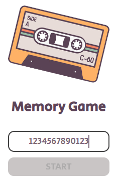

The start button is disabled until the player has filled in their name field with the mandatory information.

To provide an easy-to-understand experience for first-time users, a hover color function is included, which highlights the input name and start game elements when the user hovers over them. If the name field is not filled, the cursor mouse will become "not-allowed".
 

 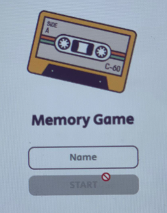
  

Once the player enters their name and clicks the start button, they will be taken to the next page where they can start playing the game. 
 

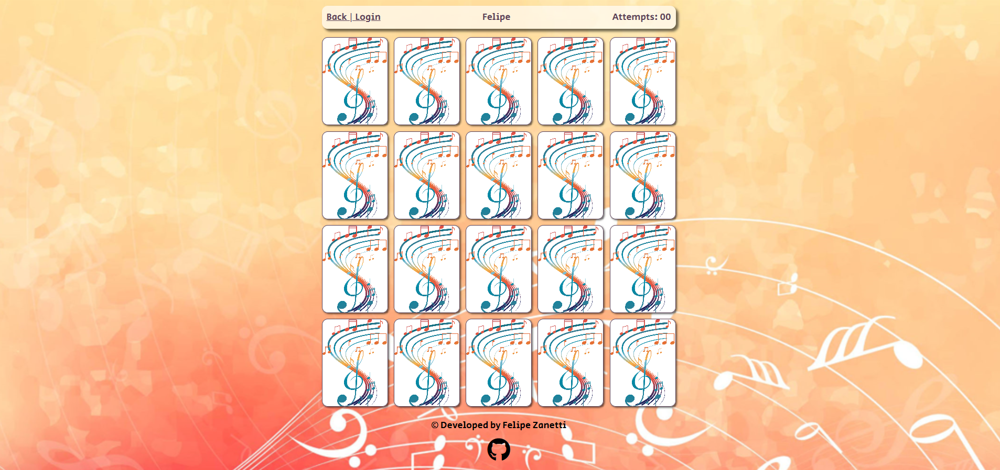
 

The top of the page features a simple panel with a back login button, the player's name, and the number of attempts taken.
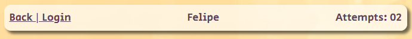
 

The main game screen features a grid of 20 cards that the player needs to match by finding 10 pairs. Each time the player clicks on a card, the attempts counter increases by one. Once the player clicks on the first card, the card will flip over, revealing the image on the other side. The player will then need to click on another card to see if it's a matching pair. If the cards match, they will become white and slightly opaque to indicate that they have been matched. If the cards do not match, they will flip back over, and the player can try again. After the first match trial, the attempts counter will increment by one.
 

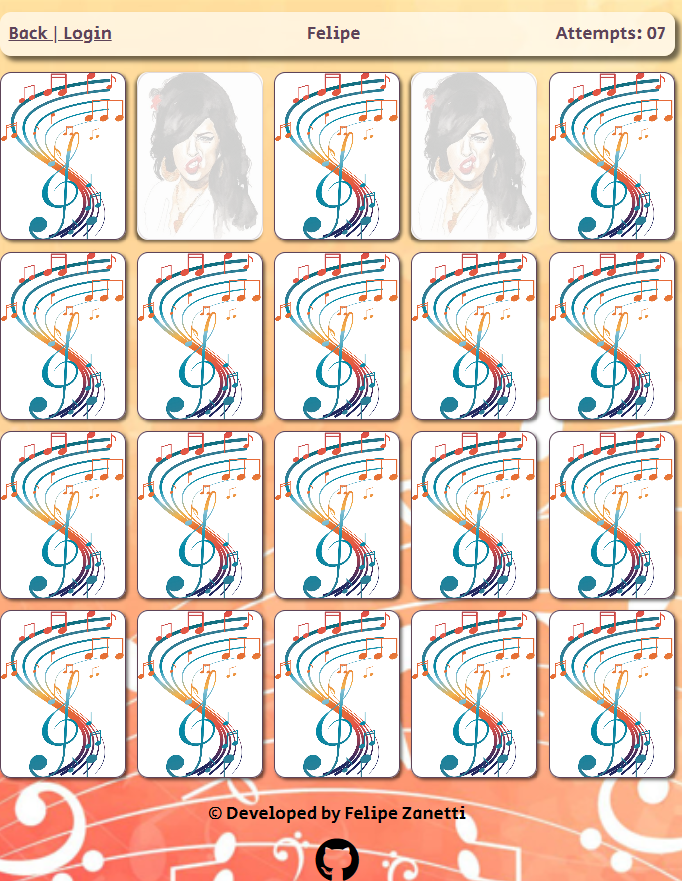
 

 After the player has matched all pairs, a message will appear on the screen congratulating them and displaying the number of attempts taken to complete the game.
The player can easily find the restart button to start the game again and try to complete it with fewer attempts. Alternatively, the player can go back to the login page by clicking on the button to change the player name. 
 

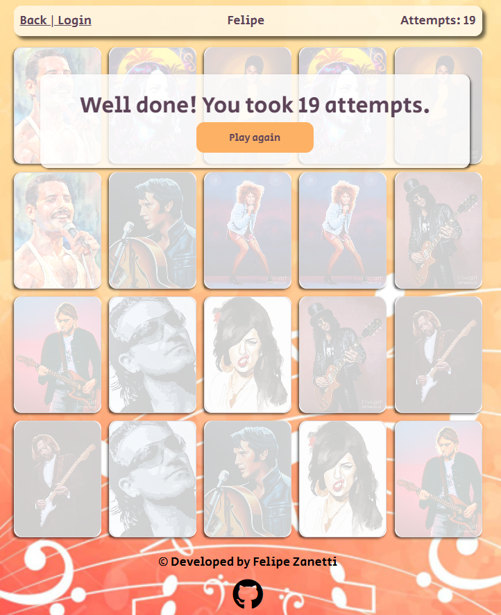
 

At the bottom of the game screen, there is a Github logo that, when clicked, will redirect the user to the game developer's Github account.

For returning players, the game provides a simple and quick way to start playing again and try to improve their attempts. Frequent players can expect new features to be implemented, such as new characters, more cards, or harder game modes in the future.

# Language used 
- HTML
- CSS
- JavaScript

# Design

## Colour Scheme
Color scheme was created using the following colours. 
- ##### `#FDB165`
- ##### `#5D4458`
- ##### `#000000`
- ##### `#FFFFFF`
- ##### `#BBB7B7`

The color scheme was chosen to create a fun and energetic environment. The background uses a gradient of orange to brown, with a combination of red and white for the cards in the back cards and background-image. This provides a contrast that makes the cards easy to read and stand out.
 

 

 
## Typography
The font used for the game is "Secular One", which is a nice and playful font that fits the Rock Star theme. It was taken from [Google Fonts](https://fonts.google.com/). Alternatively, page will use Arial, Helvetica, sans-serif if loading of the fonts for some reason fail;

## Imagery
The images used in the game are of famous rock stars, such as Freddie Mercury, David Bowie, and Kurt Cobain. These images are cartoon-like and add to the fun and  lighthearted nature of the game downloaded from [Fine Art America](https://fineartamerica.com/). 
Other cards images, back cards and background was taken from [Freepik](https://www.freepik.com/) and [Pexels](https://www.pexels.com/).

# Testing

## Further Testing
- The Website was tested on Google Chrome, Internet Explorer, Microsoft Edge and Safari browsers.
- The website was viewed on a variety of devices such as Desktop, Laptop, mobile iOS and Android tecnology.
- A large amount of testing was done to ensure that all pages were linking correctly.

## Functionality
Validators
To ensure there were no syntax errors, this project was validated using the W3C HTML Markup Validator, W3C CSS Validator Services, and Jshint.

### HTML index
 

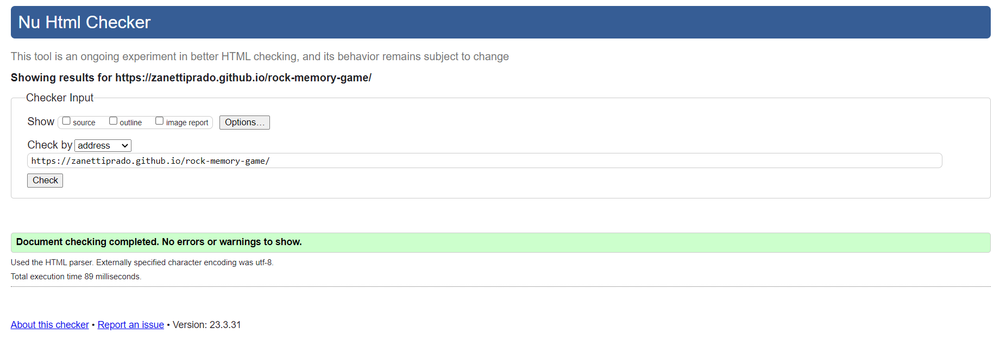
 

### HTML Game page
 

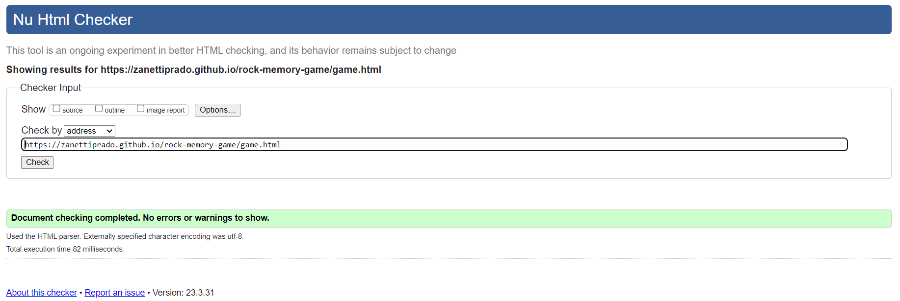
 

### Css Validator 
 

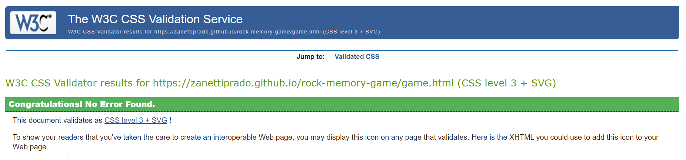
 

### JavaScript JShint Validation
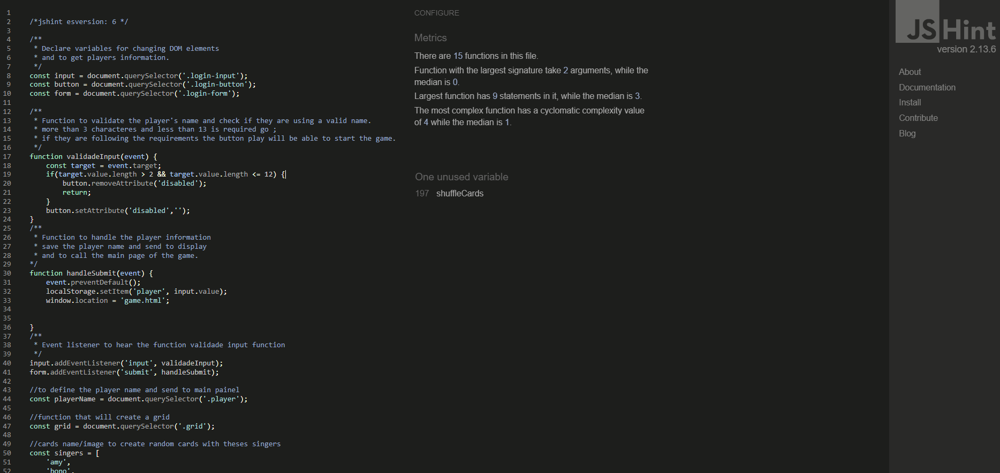
 

In addition, the website's performance, accessibility, best practices, and SEO were tested using Lighthouse within the Chrome Developer Tools.

## Accessibility
The website is as accessible as possible:
 

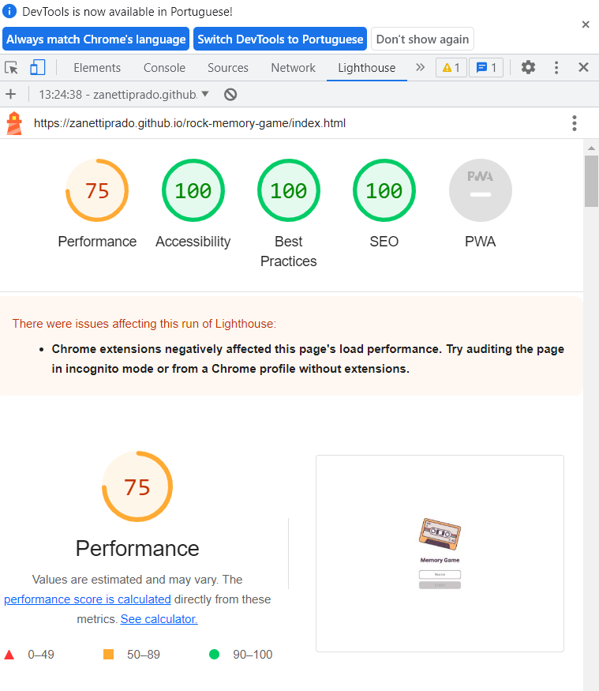
 

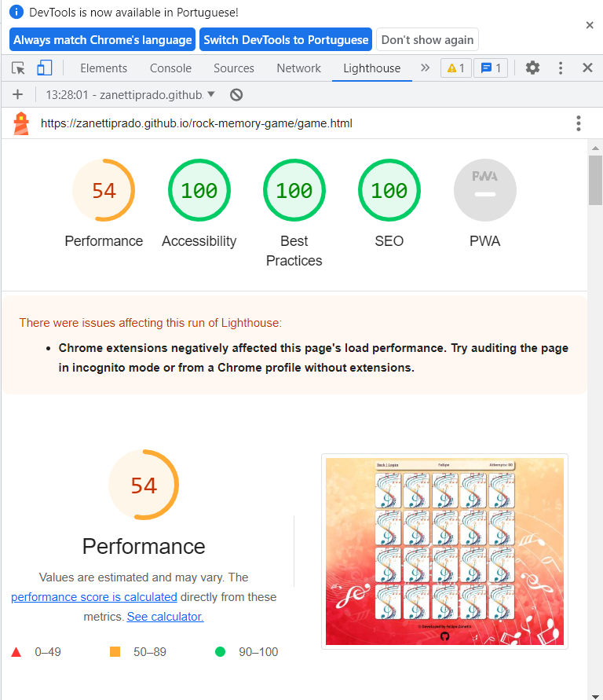
 

Although the game page's performance score is currently below 60%, it is important to note that the game itself is functioning well and the page loads smoothly. The use of PNG image format may be causing a slight decrease in performance, but we are actively working to find solutions to improve this in the future. Despite this minor setback, we are committed to providing the best user experience possible and will continue to optimize and improve the game page's performance.

# Bugs
## Fixed Bugs 
- Cards were mirrored and it was fixed by adding a function to rotate the cards.
- Cards were not loading correctly after first deployment. Neither with relative or absolute path. After changing local images and saving again it worked.

## Known Bugs:

- If you click several times at the same card too quickly, it can understands the same card as a match and make it disappear. However, this bug only occurs when the game is played at an unusually fast pace clicking several times on the grid
- Sometimes the webpage loads with mirrored cards, but this happens rarely and not constantly.

# Deployment

## GitHub Pages

### Forking the GitHub Repository
Forking a GitHub repository allows us to make a copy of the original repository on our own GitHub account, enabling us to view and make changes without affecting the original repository. To fork a GitHub repository, follow these steps:

1. Log in to GitHub and navigate to the repository [Memory Game](https://zanettiprado.github.io/rock-memory-game/index.html)..
2. Click the "Fork" button located at the top of the repository, just above the "Settings" button. This will create a copy of the original repository in your GitHub account.

### Making a Local Clone
Cloning a GitHub repository allows us to download a copy of the repository onto our local machine, making it easier to make changes and contribute to the project. To clone a GitHub repository, follow these steps:

1. Log in to GitHub and navigate to the repository [Memory Game](https://zanettiprado.github.io/rock-memory-game/index.html).
2. Under the repository name, click "Clone or download".
3. Copy the HTTPS link provided.
4. Open Git Bash.
5. Change the current working directory to the location where you want the cloned directory to be saved.
6. Type git clone and paste the copied HTTPS link to initiate the cloning process.

# Credits
As mentioned in the relevant section, this website has been developed by Felipe Zanetti as part of the diploma criteria for achieving the milestone Project 2 at Code Institute. All rights for the images used on the website are reserved for their respective owners and sources, which are mentioned and credited accordingly. These images are used to enhance the overall user experience of the website

 

